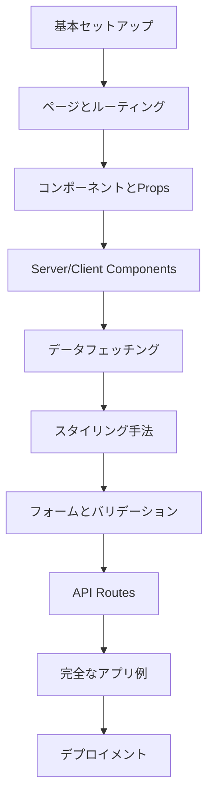

# Design Document

## Overview

Next.js学習用リポジトリは、初心者から中級者まで段階的にNext.jsを学習できる構造化されたプロジェクトです。最新のNext.js 15.4.5とApp Routerを使用し、実践的なサンプルコードと詳細な説明を通じて、学習者がNext.jsの全体像を効率的に把握できるように設計されています。

## Architecture

### プロジェクト構造

```
next-boss/
├── README.md                    # メインの学習ガイド
├── docs/                        # 詳細な学習ドキュメント
│   ├── 01-getting-started.md
│   ├── 02-routing.md
│   ├── 03-components.md
│   ├── 04-data-fetching.md
│   ├── 05-styling.md
│   └── 06-deployment.md
├── examples/                    # 段階別学習例
│   ├── 01-basic-setup/
│   ├── 02-pages-and-routing/
│   ├── 03-components-and-props/
│   ├── 04-server-client-components/
│   ├── 05-data-fetching/
│   ├── 06-styling-methods/
│   ├── 07-forms-and-validation/
│   ├── 08-api-routes/
│   └── 09-full-app-example/
├── exercises/                   # 実践課題
│   ├── exercise-01/
│   ├── exercise-02/
│   └── ...
└── app/                        # メインアプリケーション
    ├── layout.tsx
    ├── page.tsx
    └── ...
```

### 学習フロー



## Components and Interfaces

### ドキュメント構造 (docs/)

- **01-getting-started.md**: Next.jsの概要とセットアップ
- **02-routing.md**: App Routerの詳細説明
- **03-components.md**: コンポーネントの作成と使用
- **04-data-fetching.md**: データフェッチングの各手法
- **05-styling.md**: 各種スタイリング手法の比較
- **06-deployment.md**: デプロイメント方法

### 学習例 (examples/)

#### 01-basic-setup/
```
├── app/
│   ├── layout.tsx      # 基本レイアウト
│   └── page.tsx        # ホームページ
├── README.md           # この例の説明
└── package.json        # 最小限の依存関係
```

#### 02-pages-and-routing/
```
├── app/
│   ├── about/
│   │   └── page.tsx    # /about ページ
│   ├── blog/
│   │   ├── page.tsx    # /blog ページ
│   │   └── [slug]/
│   │       └── page.tsx # 動的ルート
│   └── layout.tsx
└── README.md
```

#### 04-server-client-components/
```
├── app/
│   └── demo/
│       └── page.tsx
├── components/
│   ├── ServerComponent.tsx    # 'use server'の例
│   └── ClientComponent.tsx    # 'use client'の例
└── README.md
```

### 実践課題 (exercises/)

各課題は以下の構造を持ちます：
```
exercise-XX/
├── README.md           # 課題の説明と要件
├── starter/            # 開始用のテンプレート
├── solution/           # 解答例
└── hints.md           # ヒント
```

## Data Models

### 学習進捗管理

```typescript
interface LearningProgress {
  userId: string;
  completedExamples: string[];
  completedExercises: string[];
  currentStep: number;
  lastUpdated: Date;
}

interface ExampleMetadata {
  id: string;
  title: string;
  description: string;
  difficulty: 'beginner' | 'intermediate' | 'advanced';
  prerequisites: string[];
  learningObjectives: string[];
}
```

### サンプルデータ

```typescript
// ブログ例で使用するサンプルデータ
interface BlogPost {
  id: string;
  title: string;
  content: string;
  author: string;
  publishedAt: string;
  tags: string[];
}

// ユーザー管理例で使用するデータ
interface User {
  id: string;
  name: string;
  email: string;
  avatar?: string;
}
```

## Error Handling

### 学習用エラーハンドリング

1. **段階的エラー表示**: 初心者向けに分かりやすいエラーメッセージ
2. **デバッグガイド**: よくあるエラーとその解決方法
3. **エラー境界の実装例**: 実際のプロジェクトで使える例

```typescript
// 学習用エラー境界コンポーネント
'use client'

export default function LearningErrorBoundary({
  error,
  reset,
}: {
  error: Error & { digest?: string }
  reset: () => void
}) {
  return (
    <div className="error-container">
      <h2>学習中にエラーが発生しました</h2>
      <details>
        <summary>エラーの詳細</summary>
        <pre>{error.message}</pre>
      </details>
      <button onClick={reset}>再試行</button>
    </div>
  )
}
```

## Testing Strategy

### テスト学習の段階

1. **基本テスト**: Jestを使った単体テスト
2. **コンポーネントテスト**: React Testing Library
3. **E2Eテスト**: Playwrightの基本的な使用方法

### テスト例の構造

```
examples/XX-testing/
├── __tests__/
│   ├── components/
│   ├── pages/
│   └── utils/
├── components/
├── README.md           # テストの書き方説明
└── jest.config.js
```

## Learning Resources

### 各段階の学習目標

1. **基本セットアップ**: Next.jsプロジェクトの作成と基本構造の理解
2. **ルーティング**: App Routerの仕組みと動的ルートの作成
3. **コンポーネント**: 再利用可能なコンポーネントの作成
4. **データフェッチング**: 各種データフェッチング手法の理解と実装
5. **スタイリング**: CSS Modules、Tailwind CSS、styled-componentsの比較
6. **フォーム**: フォーム処理とバリデーションの実装
7. **API**: API Routesの作成と使用
8. **統合**: 学習した内容を統合したアプリケーションの作成

### 推奨学習順序

各例には前提知識と学習目標を明記し、段階的に難易度を上げていく構成とします。

### インタラクティブ要素

- チェックリスト形式の学習進捗管理
- 各例に対する「試してみよう」セクション
- よくある質問（FAQ）セクション
- トラブルシューティングガイド