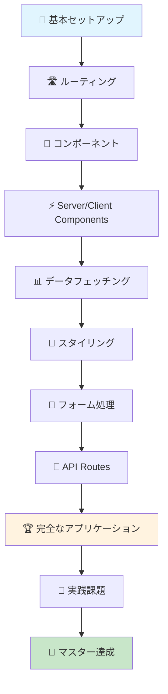

<div align="center">

# 🚀 Next Boss

**Next.js 15 + TypeScript 完全学習リポジトリ**

*初心者から上級者まで、段階的にマスターできる実践的な学習プラットフォーム*

[](https://nextjs.org/)
[](https://www.typescriptlang.org/)
[](https://reactjs.org/)
[](https://tailwindcss.com/)


</div>

---

## 🎯 なぜ Next Boss なのか？

> **「Next.jsを制する者が、モダンWeb開発を制する」**

Next Bossは、**実際のプロダクション開発で使える技術**を段階的に学習できる、日本語完全対応の学習リポジトリです。理論だけでなく、**手を動かして学ぶ**ことを重視し、初心者でも挫折しない設計になっています。

### ✨ 特徴

🎓 **段階的学習設計** - 基礎から応用まで、無理なく進められる11段階の学習パス  
💻 **実践重視** - 全ての概念に動作するコード例を提供  
🏗️ **本格的なアプリ** - 実際のプロダクションレベルのブログアプリケーション例  
📚 **詳細ドキュメント** - 各機能の「なぜ」と「どのように」を丁寧に解説  
🔧 **最新技術** - Next.js 15、React 18、TypeScript 5の最新機能を網羅  
🌐 **日本語完全対応** - 全てのドキュメントとコメントが日本語

---

## 🗺️ 学習ロードマップ



---

## 📚 学習コンテンツ

### 🎯 基礎編（完了済み ✅）

| 段階 | 内容 | 学習時間 | 難易度 | ステータス |
|------|------|----------|--------|------------|
| **01** | [🚀 基本セットアップ](./examples/01-basic-setup/) | 30分 | ⭐ | ✅ |
| **02** | [🛣️ ページとルーティング](./examples/02-pages-and-routing/) | 45分 | ⭐⭐ | ✅ |
| **03** | [🧩 コンポーネントとProps](./examples/03-components-and-props/) | 60分 | ⭐⭐ | ✅ |
| **04** | [⚡ Server/Client Components](./examples/04-server-client-components/) | 90分 | ⭐⭐⭐ | ✅ |

### 🚀 実践編（完了済み ✅）

| 段階 | 内容 | 学習時間 | 難易度 | ステータス |
|------|------|----------|--------|------------|
| **05** | [📊 データフェッチング](./examples/05-data-fetching/) | 75分 | ⭐⭐⭐ | ✅ |
| **06** | [🎨 スタイリング手法](./examples/06-styling-methods/) | 60分 | ⭐⭐ | ✅ |
| **07** | [📝 フォームとバリデーション](./examples/07-forms-and-validation/) | 90分 | ⭐⭐⭐ | ✅ |
| **08** | [🔌 API Routes](./examples/08-api-routes/) | 120分 | ⭐⭐⭐⭐ | ✅ |

### 🏆 マスター編（完了済み ✅）

| 段階 | 内容 | 学習時間 | 難易度 | ステータス |
|------|------|----------|--------|------------|
| **09** | [🏗️ 完全なブログアプリ](./examples/09-full-app-example/) | 180分 | ⭐⭐⭐⭐⭐ | ✅ |

### 🎯 チャレンジ編（開発中 🔄）

| 段階 | 内容 | 学習時間 | 難易度 | ステータス |
|------|------|----------|--------|------------|
| **10** | 💪 実践課題集 | 240分 | ⭐⭐⭐⭐ | 🔄 |
| **11** | 📊 学習進捗管理 | 60分 | ⭐⭐⭐ | 🔄 |

---

## 🚀 クイックスタート

### 前提条件

```bash
# Node.js 18以上が必要
node --version  # v18.0.0以上

# npmまたはyarnが利用可能
npm --version   # 9.0.0以上
```

### 1️⃣ リポジトリをクローン

```bash
git clone https://github.com/kantapapan/next-boss.git
cd next-boss
```

### 2️⃣ 学習を開始

```bash
# 基本セットアップから開始
cd examples/01-basic-setup
npm install
npm run dev
```

### 3️⃣ ブラウザで確認

```
http://localhost:3000
```

🎉 **おめでとうございます！Next.js学習の第一歩を踏み出しました！**

---

## 🏗️ プロジェクト構造

```
next-boss/
├── 📁 docs/                    # 📖 詳細ドキュメント
│   ├── 01-getting-started.md   # 🚀 はじめに
│   ├── 02-routing.md           # 🛣️ ルーティング詳解
│   ├── 03-components.md        # 🧩 コンポーネント設計
│   ├── 04-data-fetching.md     # 📊 データ取得パターン
│   ├── 05-styling.md           # 🎨 スタイリング手法
│   └── 06-api-routes.md        # 🔌 API設計
├── 📁 examples/                # 💻 実践的な学習例
│   ├── 01-basic-setup/         # 🚀 基本セットアップ
│   ├── 02-pages-and-routing/   # 🛣️ ルーティング
│   ├── 03-components-and-props/ # 🧩 コンポーネント
│   ├── 04-server-client-components/ # ⚡ Server/Client
│   ├── 05-data-fetching/       # 📊 データフェッチング
│   ├── 06-styling-methods/     # 🎨 スタイリング
│   ├── 07-forms-and-validation/ # 📝 フォーム処理
│   ├── 08-api-routes/          # 🔌 API Routes
│   └── 09-full-app-example/    # 🏆 完全なアプリ
├── 📁 exercises/               # 💪 実践課題（開発中）
└── 📁 app/                     # 🎯 学習ダッシュボード（開発中）
```

---

## 🎯 学習目標

このリポジトリを完走すると、以下のスキルが身につきます：

### 🎓 基礎スキル
- ✅ Next.js 15の基本概念と App Router
- ✅ TypeScriptによる型安全な開発
- ✅ Reactコンポーネントの設計パターン
- ✅ Server ComponentsとClient Componentsの使い分け

### 🚀 実践スキル
- ✅ RESTful APIの設計と実装
- ✅ フォーム処理とバリデーション
- ✅ 認証システムの実装
- ✅ データベース統合（Prisma）

### 🏆 上級スキル
- ✅ パフォーマンス最適化
- ✅ SEO対策とメタデータ管理
- ✅ テスト戦略（単体・E2E）
- ✅ デプロイメントとCI/CD

---

## 🌟 ハイライト機能

### 🏗️ 完全なブログアプリケーション

実際のプロダクションレベルのブログアプリケーションを通じて、以下を学習：

```typescript
// 🎯 型安全なAPI設計
interface ApiResponse<T = any> {
  success: boolean;
  data?: T;
  error?: string;
  pagination?: PaginationInfo;
}

// ⚡ Server Componentsでのデータフェッチ
export default async function BlogPage() {
  const posts = await getPosts({ page: 1, limit: 10 });
  return <PostList posts={posts} />;
}

// 🎨 再利用可能なコンポーネント設計
interface PostCardProps {
  post: Post;
  variant?: 'default' | 'featured';
}
```

### 📊 実践的なデータ管理

```typescript
// 🗄️ 型安全なデータストア
export const postStore = {
  getAll: (): Post[] => posts,
  getById: (id: string): Post | undefined => posts.find(p => p.id === id),
  getPublished: (): Post[] => posts.filter(p => p.published),
  search: (query: string): Post[] => /* 検索ロジック */,
};
```

---

## 🤝 コミュニティ

### 💬 質問・議論

- 🐛 **バグ報告**: [Issues](https://github.com/kantapapan/next-boss/issues)
- 💡 **機能提案**: [Discussions](https://github.com/kantapapan/next-boss/discussions)
- 📖 **学習サポート**: [Q&A](https://github.com/kantapapan/next-boss/discussions/categories/q-a)

### 🎯 貢献方法

1. 🍴 このリポジトリをフォーク
2. 🌿 機能ブランチを作成 (`git checkout -b feature/amazing-feature`)
3. 💾 変更をコミット (`git commit -m 'Add amazing feature'`)
4. 📤 ブランチにプッシュ (`git push origin feature/amazing-feature`)
5. 🔄 プルリクエストを作成

---

## 📈 学習進捗

```
🎯 基礎編     ████████████████████ 100% (4/4)
🚀 実践編     ████████████████████ 100% (4/4)  
🏆 マスター編  ████████████████████ 100% (1/1)
💪 チャレンジ編 ████████░░░░░░░░░░░░  33% (0/3)

総合進捗: ████████████████░░░░ 73% (11/15)
```

---

## 🏆 次のマイルストーン

- [ ] 💪 **実践課題集** - 手を動かして学ぶ6つのチャレンジ
- [ ] 📊 **学習進捗管理** - 個人の学習状況を可視化
- [ ] 🎯 **学習ダッシュボード** - 統合された学習体験
- [ ] 🚀 **デプロイメントガイド** - 本番環境への展開方法

---

## 📄 ライセンス

このプロジェクトは [MIT License](LICENSE) の下で公開されています。

---

## 🙏 謝辞

このプロジェクトは、Next.jsコミュニティの素晴らしい貢献と、学習者の皆様からのフィードバックによって成り立っています。

---

<div align="center">

### 🚀 今すぐ始めよう！

**Next.jsマスターへの道は、一歩から始まります**

[📚 学習を開始する](./examples/01-basic-setup/) | [🤝 コミュニティに参加](https://github.com/kantapapan/next-boss/discussions) | [⭐ スターをつける](https://github.com/kantapapan/next-boss)

---

**Made with ❤️ for the Next.js community**

</div>